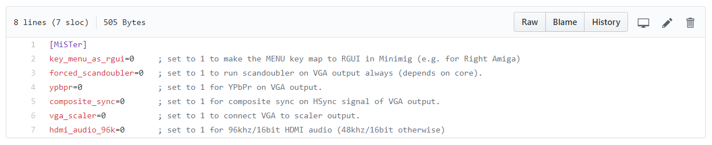

## MiSTer.ini

The MiSTer.ini configuration file contains settings for the MiSTer. The file itself can be found here: [MiSTer.ini](https://github.com/MiSTer-devel/Main_MiSTer/blob/master/MiSTer.ini).

Download and copy the `MiSTer.ini` file to the root of your SD-Card. Open it with your favorite editor (e.g. Notepad++) and change the parameters accordingly to the following description.

***

**List of INI Settings**
- [bootcore](#bootcore)
- [bootcore_timeout](#bootcore_timeout)
- [composite_sync](#composite_sync)
- [controller_info](#controller_info)
- [direct_video](#direct_video)
- [forced_scandoubler](#forced_scandoubler)
- [hdmi_limited](#hdmi_limited)
- [hdmi_audio_96k](#hdmi_audio_96k)
- [key_menu_as_rgui](#key_menu_as_rgui)
- [recents](#recents)
- [vscale_mode](#vscale_mode)
- [vga_scaler](#vga_scaler)
- [vsync_adjust](#vsync_adjust)
- [ypbpr](#ypbpr)

***

### bootcore
If specified, selects core to run at startup (instead of menu)
`bootcore=lastcore` Automatically loads the last used core
`bootcore=lastcoreexact` Automatically loads the last used core, matching time stamp e.g. core_yyymmdd.rbf
`bootcore=[corename]` Loads [corename]_*.rbf at startup (first file found on SD card)
`bootcore=[corename_yyyymmdd.rbf]` Loads [corename_yyyymmdd].rbf at startup (exact file name)

### bootcore_timeout
Number of seconds to wait before auto core boot
`bootcore=lastcore=10`  Value can be 10 to 30 seconds  

### direct_video

Feature for using the HDMI port with DACs to produce analog video. See more information in [this page](Direct-Video.md).

`direct_video=1` to activate it (disables compatibility with HDMI TVs and monitors).

`direct_video=0` to deactivate it.

### key_menu_as_rgui
Makes the MENU key map to RGUI in Minimig (e.g. for Right Amiga)

`key_menu_as_rgui=1` set the MENU key map to RGUI

`key_menu_as_rgui=0` dont set the MENU key map to RGUI

### forced_scandoubler
Run scandoubler on VGA output always (depends on core).

Most modern monitors won't support the 15 KHz horizontal sync output signal through the VGA connector. This option doubles the frequency of horizontal sync signal and brings it in a compatible range for modern monitors. Note that this is not a global option and is only valid for the MiSTer Menu. Each core drives the VGA output itself and requires its own setting. Check the core menu of the corresponding core via HDMI to set the scandoubler option if available / necessary.

`forced_scandoubler=1` activate scandoubler

`forced_scandoubler=0` deactivate scandoubler

### composite_sync
Use composite sync as horizontal sync signal on VGA output.

`composite_sync=1` activate composite sync

`composite_sync=0` deactivate composite sync

### controller_info
Seconds to display controller settings when starting a new core.

Cores support automated mapping from central joystick mapping if no core-specific joystick mapping was defined.
When this is active, MiSTer shows a tiny popup displaying the button assignment. This setting controls the time that pop-up is displayed (and can switch it off)

`controller_info=0` Do not display mapping info pop-up

`controller_info=1`, `controller_info=10` Seconds to display controller mapping pop up

### hdmi_audio_96k
HDMI audio output options

`hdmi_audio_96k=1` 96khz/16bit HDMI audio

`hdmi_audio_96k=0` 48khz/16bit HDMI audio

### hdmi_limited
Change between Full Range RGB and Limited Range RGB

`hdmi_limited=0` Full Range RGB (0-255)

`hdmi_limited=1` Limited Range RGB (16-235)

`hdmi_limited=2` Limited Range common DAC variant (16-255)

### recents
Set to 1 to show recently played games when selecting a ROM to load

(Note: using this mode increases writes to SD card, which may increase wear over the long term)

`recents=0` Default behavior - normal mode

`recents=1` Show recent files

### vscale_mode
Options for integer scaling.

`vscale_mode=0` scale to fit the screen height.

`vscale_mode=1` use integer scale only.

`vscale_mode=2` use 0.5 steps of scale.

`vscale_mode=3` use 0.25 steps of scale.

### vga_scaler
This option makes the VGA (DB15) connector output of the scaler. In other words, it makes the VGA have the same resolution as HDMI (1080p or 720p, or as per your overall video settings).

`vga_scaler=1` VGA DB15 connector will have the full scaler output 

`vga_scaler=0` VGA DB15 will have an independent video output, separate from main scaler (e.g. 240p or 480p)

### video_info
Seconds to display video information on startup. Defaults to zero.

`video_info=0` Do not display video info
`video_info=1`, `video_info=10` Specify number of seconds to show video info

### ypbpr
Use YPbPr signal on VGA output.

`ypbpr=1` activate YPbPr

`ypbpr=0` deactivate YPbPr

### vsync_adjust
Sets vsync mode for HDMI video

These settings allow controlling the amount of buffering used with HDMI output. Some HDMI displays can accept non-standard signals, resulting in lower display lag. Recommended to start with 0, then try 1 and 2 to check if your display is compatible. 

`vsync_adjust=0` Default buffered 60hz HDMI video output, compatible with most HDMI devices.
`vsync_adjust=1` Adjust output HDMI Vsync to match original Vsync. Lower latency but less compatible.
`vsync_adjust=2` Low latency mode, usiing original pixel clock. Less compatible, but the lowest display lag possible.

## Adding Core-specific Settings
It is possible to specify different settings for different cores; for example, you may prefer to use Integer Scaling just for the Game Boy Advance core so that you don't need any video filters for smooth scrolling. To add a core-specific setting different from the main settings in your INI, simply add a section at the end of the file with the core name in brackets and paste your different settings below there, like so:

`[GBA]`

`vscale_mode=1`
