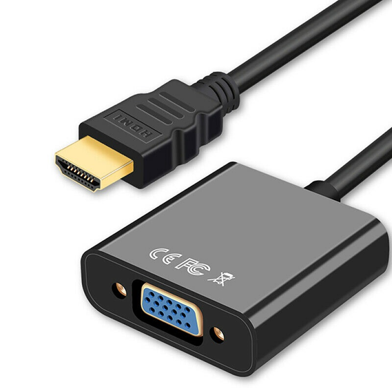
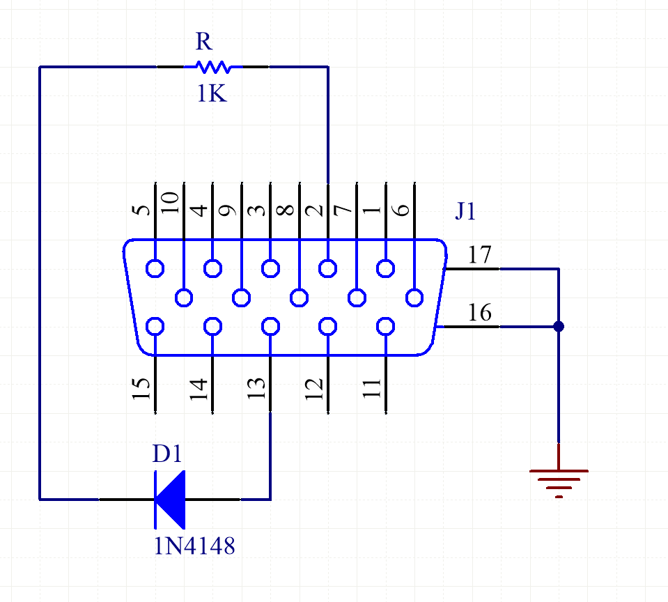

# Direct Video
Since autumn of 2019 there is a method for outputting analog video called *Direct Video* that doesn't require you to install the [IO Board](IO-Board.md) in your MiSTer. This new method offers **same** minimal latency to the VGA port from the IO Board and even better color depth in some cores. To enjoy it, you just need to activate the feature in your mister.ini file and attach a DAC to your HDMI port.

*You may use a HDMI-VGA converter similar to this one*

## How to Use

First you need a simple DAC with VGA output. Those based on the chip AG6200 (like the one in the picture) are proven to work fine and are fairly inexpensive and easy to find. Also many of them output analog audio too. The only thing we recommend is to not hotplug them or pull them out from your MiSTer while it is still **ON**, since you might damage your HDMI port in the process.

Then you need to add the following line to your [mister.ini](Configuration-Files.md) file:

`direct_video=1`

This activates the *Direct Video* feature when the system starts. Once it's enabled, it makes your HDMI port to output the raw and unprocessed digital audio/video signal from the loaded core, which is consumed by your DAC. This also means, that once this feature is active, you can't connect your MiSTer to your HDMI-compatible TVs or monitors, since they require a standard HDMI signal to work, and the zero-lag *Direct Video* signal **IS NOT** standard HDMI.

The resulting analog video signal from your DAC should be compatible with standard CRTs if the core support standard CRT refresh frequencies (see [analog video compatibility](Analog-video-output-compatibility.md) for more details). But there is still a bit of additional configuration you need to do depending on which kind of analog video signal you want to use.

- Setup for RGB signals: For this, you'll want to enable composite sync on HSync signal in your mister.ini (`composite_sync=1`). After that, you are good to plug a RGB-compatible VGA-SCART cable to your TV.

- Setup for YPbPr signals: Enable composite sync and YPbPr on your [mister.ini](Configuration-Files.md) file. Then you'll need to add a sync-on-green circuit to the VGA output. SOG can be very simplified, you just need a diode (1N4148) and a 1k resistor.

*Connection: from HSync -> anode of diode, cathode of diode -> resistor, resistor to Green signal.*

- Doubling frequency: This is a handy way to use those modern monitors that have VGA input but are typically not compatible with 15KHz signals, and require 31KHz analog video. In case you need it, you just have to set `forced_scandoubler=1` in your mister.ini to turn a 15KHz signal into a 31Khz one (See which cores output 15KHz video [here](Analog-video-output-compatibility.md)).

## Color Depth

*Direct Video* produces a 24bit color signal, which is superior to the 18bit signal coming from the IO Board. Technically though, very few cores use 24bit color, so the difference is not as important as it might seem at first glance.

Also most cheap DACs, like the ones based on the chip AG6200, don't produce Full Range RGB. They instead produce Limited Range RGB (16-235) or much more commonly a nonspec Limited Range variant (16-255). In order to compensate for that, you may configure the `hdmi_limited` option in your mister.ini to adjust the signal to your DAC.

- Full Range (0-255): `hdmi_limited=0`.
- Limited Range (16-235): `hdmi_limited=1`.
- Limited Range common DAC variant (16-255): `hdmi_limited=2`.

## Compatibility

*Direct Video* is compatible with most current cores and will be supported in all future cores coming to MiSTer.