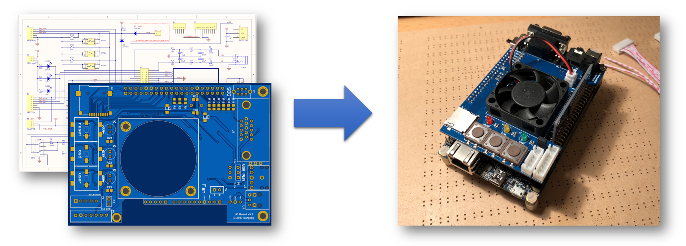

The following section will walk you through the steps of creating your own Mister IO Board. It describes where to order all necessary parts like PCB and components. It will also give you an overview on the equipment you need and show you how to assemble the board.

### Important Note:
I/O board has an option to provide either +5V or +3.3V through VGA PIN9. It's supposed to be used in some handmade active VGA adapters/converters. Some cables and displays have PIN9 grounded which will make short circuit if P8(VGA PWR) has jumper! It's advised not to solder P8 at all, so PIN9 won't have a power and it will be safe to connect any cable/display. Use P8 only when you are absolutely sure you need the power on PIN9.

------

### 1. Order PCB

#### Approved PCB Manufactors
  * [PCBway](https://www.pcbway.com/setinvite.aspx?inviteid=43024) - [Quick order of I/O Board v5.2](https://www.pcbway.com/project/shareproject/MiSTer_I_O_Board_v5_2.html)
  * [EasyEDA](https://easyeda.com/)
  * [JLCPCB](https://jlcpcb.com/)
  * [OSH Park](https://oshpark.com/)

#### PCB Layout (Gerber Files)
Check the MiSTer hardware repository for the most recent PCB files: [MiSTer_Hardware](https://github.com/MiSTer-devel/Hardware_MiSTer)

------

### 2. Order Components

This is a general overview of the components, including reference parts that were successfully used to assemble a MiSTer IO Board <b>version 5.2</b>.

| Name | Component | Package | Value | Reference Parts |
|---|---|:---:|:---:|---|
| C1, C2, C3, C4 | Capacitor (Ceramic) | 0805 | 10nF | [KEMET   C0805C103K5RACTU](https://www.digikey.com/products/en?keywords=399-1158-1-ND) |
| C5, C6, C8 | Capacitor (Tantalum) | 2312 | 100uF | [VISHAY   293D107X96R3C2TE3](https://www.digikey.com/products/en?keywords=718-1058-1-ND) |
| C7 | Capacitor (Ceramic) | 0805 | 1uF | [KEMET   C0805C105K4RACTU](https://www.digikey.com/products/en?keywords=399-1284-1-ND) |
| C9, C10, C11, C12 | Capacitor (Ceramic) | 0805 | 10uF | [KEMET   C0805C106K8PACTU](https://www.digikey.com/products/en?keywords=399-4925-1-ND) |
| R1, R7, R13 | Resistor 1% 1/8W | 0805 | 500 | [YAGEO   RC0805FR-07510RL](https://www.digikey.com/products/en?keywords=311-510CRCT-ND) |
| R2, R8, R14 | Resistor 1% 1/8W | 0805 | 1.1K | [YAGEO   RC0805FR-071K1L](https://www.digikey.com/products/en?keywords=311-1.10KCRCT-ND) |
| R3, R9, R15 | Resistor 1% 1/8W | 0805 | 2.2K | [YAGEO   RC0805FR-072K2L](https://www.digikey.com/products/en?keywords=311-2.20KCRCT-ND) |
| R4, R10, R16 | Resistor 1% 1/8W | 0805 | 4.3K | [YAGEO   RC0805FR-074K3L](https://www.digikey.com/products/en?keywords=311-4.30KCRCT-ND) |
| R5, R11, R17 | Resistor 1% 1/8W | 0805 | 9.1K | [YAGEO   RC0805FR-079K1L](https://www.digikey.com/products/en?keywords=311-9.10KCRCT-ND) |
| R6, R12, R18 | Resistor 1% 1/8W | 0805 | 18K | [YAGEO   RC0805FR-0718KL](https://www.digikey.com/products/en?keywords=311-18.0KCRCT-ND) |
| R19, R20 | Resistor 5% 1/8W | 0805 | 100 | [YAGEO   RC0805FR-07100RL](https://www.digikey.com/products/en?keywords=311-100CRCT-ND) |
| R21, R22, R23 | Resistor 5% 1/8W | 0805 | 200 | [YAGEO   RC0805FR-07200RL](https://www.digikey.com/products/en?keywords=311-200CRCT-ND) |
| R24, R25, R26, R27 | Resistor 5% 1/8W | 0805 | 560 | [YAGEO   RC0805FR-07560RL](https://www.digikey.com/products/en?keywords=311-560CRCT-ND) |
| R28, R31 | Resistor 5% 1/8W | 0805 | 10K | [YAGEO   RC0805FR-0710KL](https://www.digikey.com/products/en?keywords=311-10.0KCRCT-ND) |
| R29 | Resistor 5% 1/8W | 0805 | 1K | [YAGEO   RC0805FR-071KL](https://www.digikey.com/products/en?keywords=311-1.00KCRCT-ND) |
| R30 | Resistor 5% 1/8W | 0805 | 680 | [YAGEO   RC0805FR-07680RL](https://www.digikey.com/products/en?keywords=311-680CRCT-ND) |
| D1, D2 | General Purpose Diode | SOD80 | BAV100 | [VISHAY   BAV100-GS08](https://www.digikey.com/products/en?keywords=BAV100-GS08CT-ND) |
| LED1 | LED Red | 3mm | - | [WURTH   151031SS06000](https://www.digikey.com/products/en?keywords=732-5006-ND) |
| LED2 | LED Yellow | 3mm | - | [WURTH   151031YS06000](https://www.digikey.com/products/en?keywords=732-5010-ND) |
| LED3 | LED Green | 3mm | - | [WURTH   151031VS04000](https://www.digikey.com/products/en?keywords=732-5007-ND) |
| SW1, SW2, SW3 | Switch Tactile | - | - | [E-Switch   TL3300DF160Q](https://www.digikey.com/products/en?keywords=EG4906CT-ND) |
| SW4 | Slide Switch, DPDT, On/On, Non-Shorting (BBM) | 2.54mm | - | [C&K   OS202011MA0QN1](https://www.digikey.com/product-detail/en/c-k/OS202011MA0QN1/CKN9563-ND/1981434) |
| P1 (GPIO) | Female Header, Double Row, Isolation Height: 11.05mm | 2,54mm | - | [No Name (AliExpress)](https://www.aliexpress.com/item/5pcs-2-54-mm-0-10-Pitch-2x20-40-Position-Dual-Row-PCB-Female-Header-Through/32832362977.html) |
| P2, P5, P8, P9 | Male Pin Header, Single Row | 2.54mm | - | [SULLINS   PRPC040SAAN-RC](https://www.digikey.com/products/en?keywords=S1011EC-40-ND) |
| P3 | Connector for External Buttons | XH2.54 | 5P | [No Name   (AliExpress)](https://www.aliexpress.com/item/10pcs-lot-20cm-XH-red-white-ribbon-cable-dual-head-same-direction-XH2-54-2P-3P/32816833194.html) |
| P4 | Connector for External LEDs | XH2.54 | 7P | [No Name   (AliExpress)](https://www.aliexpress.com/item/10pcs-lot-20cm-XH-red-white-ribbon-cable-dual-head-same-direction-XH2-54-2P-3P/32816833194.html) |
| P# (FAN) | Connector for Fan | XH2.54 | 2P | [No Name   (AliExpress)](https://www.aliexpress.com/item/10pcs-lot-20cm-XH-red-white-ribbon-cable-dual-head-same-direction-XH2-54-2P-3P/32816833194.html) |
| P6 | Stackable Arduino Header | 2.54mm | 5 Pin | [No Name   (AliExpress)](https://www.aliexpress.com/item/20-Pcs-Per-Lot-2-54mm-Pitch-6-Pin-Single-Row-Stackable-Shield-Female-Header-for/32273300535.html)   (must be cut) |
| P7 | Stackable Arduino Header | 2.54mm | 10 Pin | [No Name   (AliExpress)](https://www.aliexpress.com/item/20-Pcs-Per-Lot-2-54mm-Pitch-10-Pin-Single-Row-Stackable-Shield-Female-Header-for/32272959208.html) |
| P# (Power) | Female Header for Power  | 2.54mm | 3 Pin | [No Name   (AliExpress)](https://www.aliexpress.com/item/20-Pcs-Per-Lot-2-54mm-Pitch-3-Pin-Female-Single-Row-Straight-Header-Strip-PH/1798441671.html) |
| Q1 | Transistor NPN | SOT23 | BC847 | [ON   BC847BLT1G](https://www.digikey.com/products/en?keywords=BC847BLT1GOSCT-ND) |
| J1 | VGA Connector, 15 Pos, 3 Row, Female Connector, Right Angle | D-Sub | - | [Omron   XM4L-1542-132](https://www.digikey.com/product-detail/en/omron-electronics-inc-emc-div/XM4L-1542-132/OR1096-ND/1829580) |
| J2 | Phone Jack 3.5mm, Right Angle | - | - | [CUI   SJ1-3523N](https://www.digikey.com/products/en?keywords=CP1-3523N-ND) |
| J3 | Micro SD-Card Holder | - | - | [No Name   (AliExpress)](https://www.aliexpress.com/item/10pcs-lot-9pin-Micro-SD-card-slot-connectors-size-14-15mm-TF-card-deck-fit-for/32763208642.html?spm=a2g0x.10010108.1000016.1.76105513wSfAxQ&isOrigTitle=true) |
| U1 | TOSLINK Optical Fiber Connector | - | - | [CLIFF   FC684208T](http://uk.rs-online.com/web/p/fibre-optic-connectors/8051677/) |
| FAN | Fan | 40x40x10 | 5V |  [Sunon   MF40100V2-1000U-A99](https://www.digikey.com/products/en?keywords=259-1795-ND) (Very Noisy) |
| JMPR | Jumper for Pin-Header | 2.54mm | 2 Pin |  [Sullins   SPC02SYAN](https://www.digikey.com/products/en?keywords=S9001-ND) |
| HEATSINK | Heatsink | 21x21x11.5 | - | [Wakefield-Vette   624-45ABT3](https://www.digikey.com/products/en?keywords=345-1089-ND) |

### Example of BOM on Octopart:
https://octopart.com/bom-tool/KurIZPWc

## Convenient order of manual soldering:
1) resistors, capacitors, diodes, transistor
2) SD socket
3) buttons
4) LEDs
5) connectors, jumpers, switch

