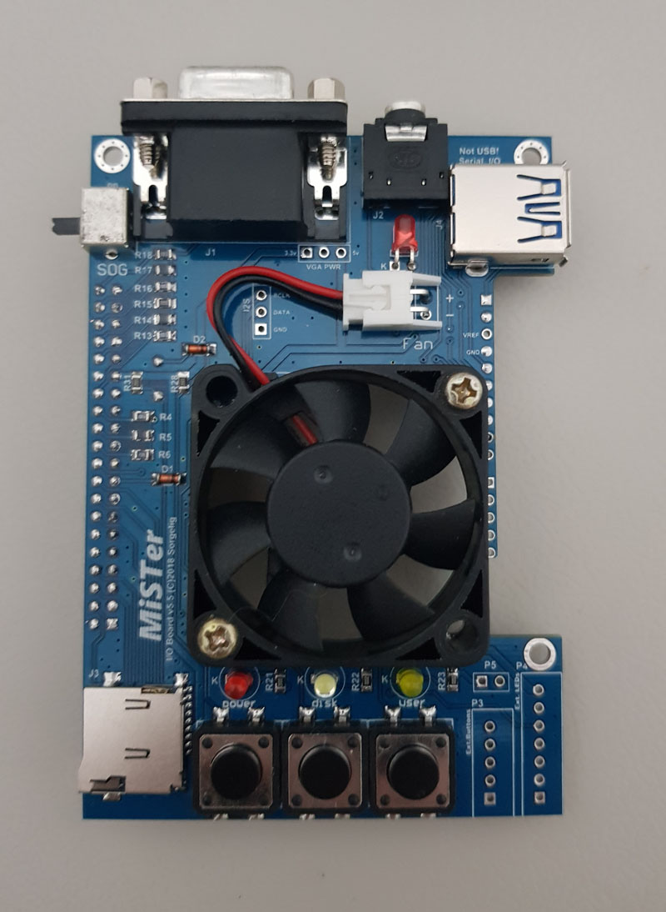

Actual Board Revision: 5.5

The MiSTer IO Board is an **optional** expansion. It adds the following features to the MiSTer Platform:
* VGA Connector
* 3.5mm Audio Jack with TOSLink
* 3 Buttons
* 3 Status LEDs
* Secondary SD card (for some cores)
* FAN for cooling the FPGA
* Expansion connector
* Additional connectors to integrate the MiSTer into cases.

