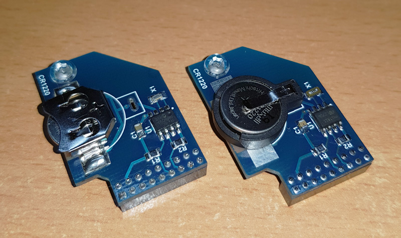
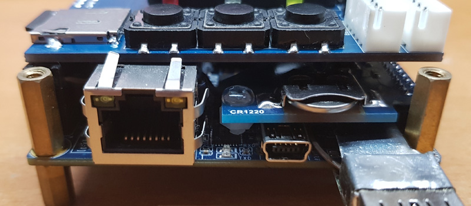

# RTC board. (draft description)

Some cores (ao486, Minimig) use clock, and MiSTer provides the real time for such cores. MiSTer can take the time from internet if active connection is present. 

This board is pretty simple and provide real time offline. It supports 2 types of battery holders and several types of RTC ICs. It's plugged into LTC connector.

## Usage notes
To get real time saved, simply connect MiSTer to internet and let it run for around 15 minutes.

By default the time zone is UTC(GMT). If you want to get the time of your zone, you need to do following:
* connect to MiSTer by FTP/SFTP
* navigate to /usr/share/zoneinfo/posix folder and find there the name of your place or time zone.
* copy that file to your computer under name timezone
* copy it back to MiSTer here: /media/fat/timezone
