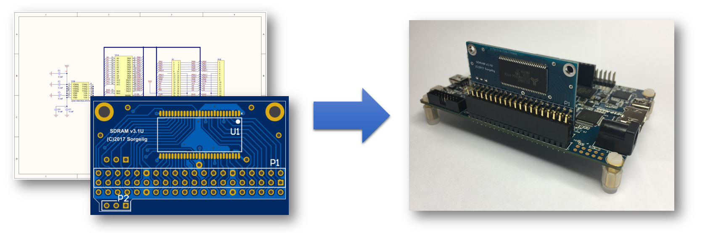
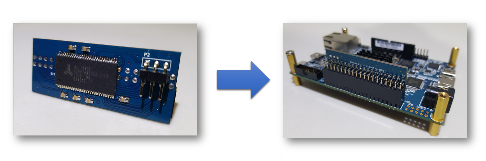
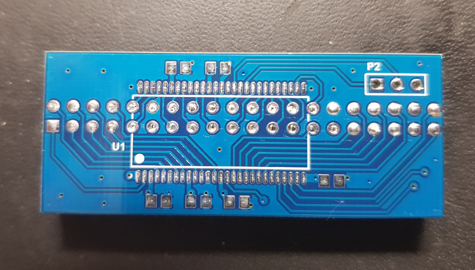

The following section will walk you through all steps of creating your own SDRAM Board. It describes where to order all necessary parts like PCB and components. It will also give you an overview on the equipment you need and show you how to assemble the board.

### Universal board:

### Extra slim board:

------

### 1. Order PCB

#### Approved PCB Manufactors
* [PCBway](https://www.pcbway.com/setinvite.aspx?inviteid=43024)
* [EasyEDA](https://easyeda.com/)
* [JLCPCB](https://jlcpcb.com/)
* [OSH Park](https://oshpark.com/)

#### PCB Layout (Gerber Files)
Check the MiSTer hardware repository for the most recent PCB files: [MiSTer_Hardware](https://github.com/MiSTer-devel/Hardware_MiSTer)

* [Universal SDRAM Board v3.1U](https://github.com/MiSTer-devel/Hardware_MiSTer/blob/master/gerber_releases/sdram_uni_3.1U.zip?raw=true) --> [One-Click Order (PCBWay)](https://www.pcbway.com/project/shareproject/MiSTer_SDRAM_board_v3_1__Universal_.html)

* [Extra slim SDRAM Board v1.1](https://github.com/MiSTer-devel/Hardware_MiSTer/blob/master/gerber_releases/sdram_xs_1.1.zip?raw=true) --> [One-Click Order (PCBWay)](https://www.pcbway.com/project/shareproject/MiSTer_SDRAM_extra_slim_board_v1_1_.html)

------

### 2. Order Components
This is a general overview of the components, including reference parts that were successfully used to assemble a MiSTer SDRAM Board.

#### Universal v3.1U vertical board

| Name | Component | Package | Value | Reference Parts |
|---|---|:---:|:---:|:---:|
| C1 - C5 | Capacitor (Ceramic) | 0805 | 0.1uF | [KEMET   C0805C104J5RACTU](https://www.digikey.com/products/en?keywords=399-1171-1-ND) |
| U1 | IC SDRAM 256MBIT 166MHZ 32MB | TSOP-54 | 32 MB | [Alliance Memory   AS4C16M16SA-6TCN](https://www.digikey.com/products/en?keywords=1450-1252-ND) |
| P1 | 2x20 (40 Pos.) Female Header, Double Row, Right Angle, | 2,54mm Pitch | - | [No Name (AliExress)](https://www.aliexpress.com/item/20Pcs-Per-Lot-2-54mm-Pitch-2x20-Pin-40-Pin-Female-Double-Row-Right-Angle-Pin/32758316130.html) |
| P2 | 1x3 (3 Pos.) Male Pin Header, Single Row, Right Angle,   Contact Length: 5.84mm (Mating), 5.84mm (Post), Insulation Height: 2.54mm | 2,54mm Pitch | - | [Sullins Connector   PRPC040SBBN-M71RC](https://www.digikey.com/products/en?keywords=S1121EC-40-ND) |

#### Universal v3.1U horizontal board

| Name | Component | Package | Value | Reference Parts |
|---|---|:---:|:---:|:---:|
| C1 - C5 | Capacitor (Ceramic) | 0805 | 0.1uF | [KEMET   C0805C104J5RACTU](https://www.digikey.com/products/en?keywords=399-1171-1-ND) |
| U1 | IC SDRAM 256MBIT 166MHZ 32MB | TSOP-54 | 32 MB | [Alliance Memory   AS4C16M16SA-6TCN](https://www.digikey.com/products/en?keywords=1450-1252-ND) |
| P1 | 2x20 (40 Pos.) Female Header, Double Row, Isolation Height: 11mm | 2.54mm | - | [No Name (AliExpress)](https://www.aliexpress.com/item/10-Pcs-2-54mm-Pitch-2x20-Pin-40-Pin-Female-Double-Row-Long-Pin-Header-Strip/32791223993.html) |
| P2 | 1x3 (3 Pos.) Male Pin Header, Single Row, Straight,   Contact Length: 6.1mm (Mating), 3mm (Post), Insulation Height: 2.54mm | 2.54mm | - | [Sullins Connector   PRPC040SAAN-RC](https://www.digikey.com/products/en?keywords=S1011EC-40-ND) |

#### Extra slim v1.1 board

| Name | Component | Package | Value | Reference Parts |
|---|---|:---:|:---:|:---:|
| C1 - C6 | Capacitor (Ceramic) | 0805 | 0.1uF | [KEMET   C0805C104J5RACTU](https://www.digikey.com/products/en?keywords=399-1171-1-ND) |
| U1 | IC SDRAM 256MBIT 166MHZ 32MB | TSOP-54 | 32 MB | [Alliance Memory   AS4C16M16SA-6TCN](https://www.digikey.com/products/en?keywords=1450-1252-ND) |
| P1 | 2x20 (40 Pos.) Female Header, Double Row, Right Angle, | 2,54mm Pitch | - | [No Name (AliExress)](https://www.aliexpress.com/item/20Pcs-Per-Lot-2-54mm-Pitch-2x20-Pin-40-Pin-Female-Double-Row-Right-Angle-Pin/32758316130.html) |
| P2 | 1x3 (3 Pos.) Male Pin Header, Single Row, Right Angle,   Contact Length: 5.84mm (Mating), 5.84mm (Post), Insulation Height: 2.54mm | 2,54mm Pitch | - | [Sullins Connector   PRPC040SBBN-M71RC](https://www.digikey.com/products/en?keywords=S1121EC-40-ND) |

#### Bill of Material
User approved BOMs and One-Click shopping Carts. If you have successfully build a MiSTer IO Board and used your own components, then share them with us :)
* [Octopart: SDRAM Board (3.1U, Vertical)](https://octopart.com/bom-tool/7Rk7V11w) (Missing Parts: P1)
* [Octopart: SDRAM Board (3.1U, Horizontal)](https://octopart.com/bom-tool/x1qGHooE) (Missing Parts: P1)
* For extra slim board 1.1 use BOM for vertical v3.1U, just add one more capacitor.

------

### 3. Assemble the Board

#### Soldering Tutorial
SDRAM Board v3.1 (by [Negative Solution](https://www.youtube.com/channel/UCLHmCwunWQkMvrlgE2BJXTw)):

### Extra slim board notes:
Soldering this board is a little tricky. The board has SDRAM chip laid over connector, so connector should be soldered with neither pins nor solder protruding the board. See the picture:

How to cut the pins at the same level and prevent them protruding without special equipment? Insert the connector and using sharp flat nippers trim the pins as close to board as possible. Take the standard printer paper and bend it once, so you will get the 2 layers of paper. Insert these 2 layers of paper between the board and connector. Pins of connector will sink to the level (or slightly dipper) of traces. Solder the pins. Remove the paper. Use solder wick to remove the excessive amount of solder, but make sure it's enough solder remains inside the holes, so pins won't be disconnected with mechanical force. Solder the SDRAM chip and other components.