This is an essential guide for your first time setup of the MiSTer system. It will guide you through the SD-card installation, help you update the MiSTer system files and shows you how to run a game on an example core (NES).

## Requirements
You will need the following things to get everything started.

For the SD-card setup:
* Windows 7/8/10
* Internet connection
* SD-card reader
* SD-card >2GB

...and to run it:
* DE10-nano board + 5V power supply
* [SDRAM-Board](SDRAM-Board) (see wiki page for instructions)
* Monitor + HDMI cable
* USB-OTG adapter + USB keyboard

Check out the [How to start](How-to-start-with-MiSTer) and [Input devices](Input-devices) wiki pages for more information on the peripheral.

## Prepare the SD-card

1. Download the latest SD-card installer from [here](https://github.com/MiSTer-devel/SD-Installer-Win64_MiSTer)

2. Insert your SD-card into your PC.

3. Extract the `release_201#####.rar` file.

4. Start **"MiSTer SD Card Utility.exe"**

 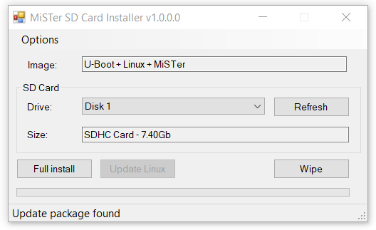

5. Make sure it says **"U-Boot + Linux + MiSTer"** in the **"Image"** field.
   - Newer versions of Mister SD Card Utility will says **"Boot + Files"** in the **"Image"** field.

6. Select your SD-card in the **"Drive"** field. If you have inserted the SD-card after starting the Installer, hit the  **"Refresh"** button and your SD-card should appear.

7. Press **"Full Install"** and confirm the following Warning with **"Yes"**. All data on the SD-card will be deleted! Make sure to backup the SD-card before you execute this!

 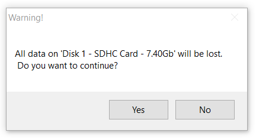

8. Confirm the successful installation with **"ok"**

  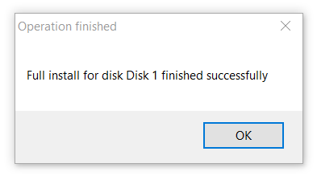

9. The Installer will open multiple windows which will ask you to format the drive. **Don't format the drive!** Press **"Cancel"** in all three windows.

 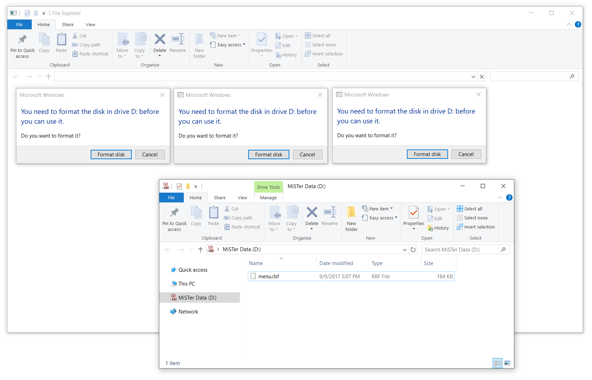

10. The SD-card File Explorer window will be opened twice, close one of them. The SD-card should contain the following three files / folder:

 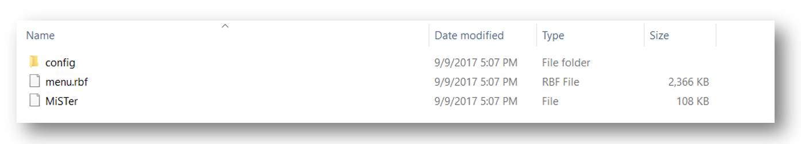

 If you see only the `menu.rbf` file, hit **F5** on your keyboard or **"right click > Refresh"** to refresh the window. You should see all three files now.

 The files you see are:
 * `linux` - Folder containing linux files
 * `config` - The configuration folder. You can place configuration files like the mister.ini in this folder. Check out the [Configuration Files](Configuration-Files) wiki page for more information (not yet so...).
   - This folder is no more created by newer version of SD Card Utility, but it will be created automatically by the MiSTer hardware at first run (you can manually create and populate it if you want)
 * `menu.rbf` - This is the actual MiSTer menu core, which you will see when you boot up the DE10-Nano board  ([GitHub](https://github.com/MiSTer-devel/Menu_MiSTer/tree/master/releases)).
 * `MiSTer` - MiSTer main firmware ([GitHub](https://github.com/MiSTer-devel/Main_MiSTer/tree/master/releases))

## Update MiSTer files

The SD-card installer might be older then the actual binary releases of the MiSTer firmware and the menu core. Therefore, we want to bring those files up to date.

1. Go to the [MiSTer-devel/Main_MiSTer](https://github.com/MiSTer-devel/Main_MiSTer/tree/master/releases) Repository and download the most recent `MiSTer_201#####` firmware file on the bottom of the page.

 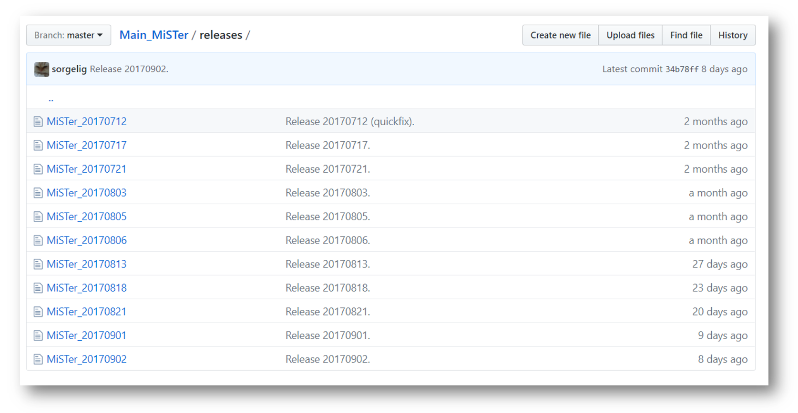

2. Rename the `MiSTer_201#####` file to `MiSTer`

 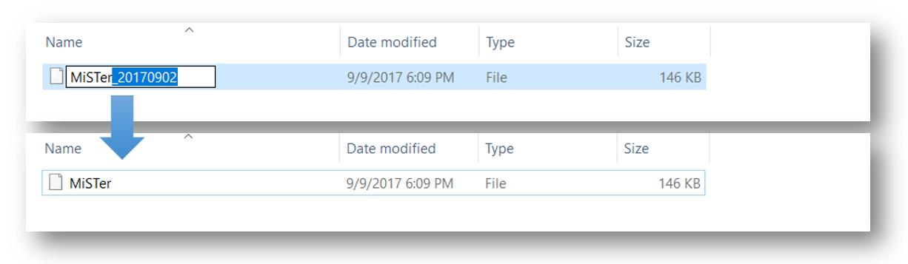

3. Copy the file over to your SD-card and override the old `MiSTer` file.

 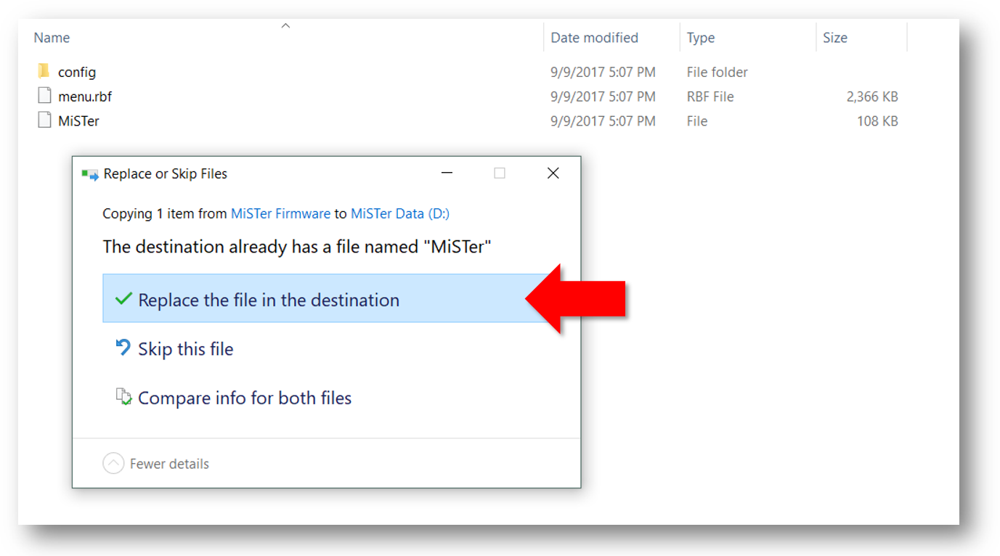

4. Repeat this for the menu core file: Go to the [MiSTer-devel/Menu_MiSTer](https://github.com/MiSTer-devel/Menu_MiSTer/tree/master/releases) repository and download the most recent `menu_201#####.rbf` core file on the bottom of the page. Rename `menu_201#####.rbf` to `menu.rbf` and override the old file on the SD-card.

## Get a core

We want to actually run a core like the NES or Amiga on our DE10-Nano FPGA board. Therefore, we have to copy a core `.rbf` file to the root of the SD-card. The sidebar on the right contains a list of MiSTer compatible cores. Check out the GitHub repository page of each core for specific information. The following description is a generic example based on the NES core, but it is applicable to most other cores.

1. Click in the sidebar on Cores > **"NES"** or go directly through this link to the [MiSTer-devel/NES_MiSTer](https://github.com/MiSTer-devel/NES_MiSTer/tree/master/releases) release folder. Download the lates `NES_20######.rbf` core file

 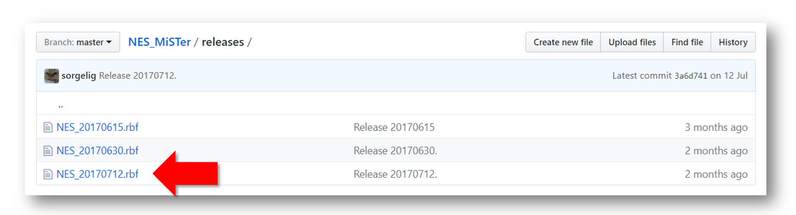

2. Copy the core file to the root of the SD-card. Leave the date in the filename. By this, you know which version you are actually using.

 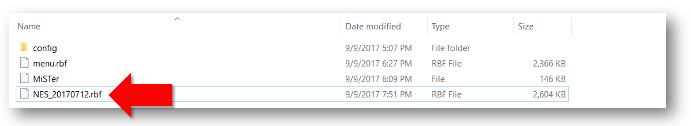

3. Create a new folder and name it for example `NES Games`.

 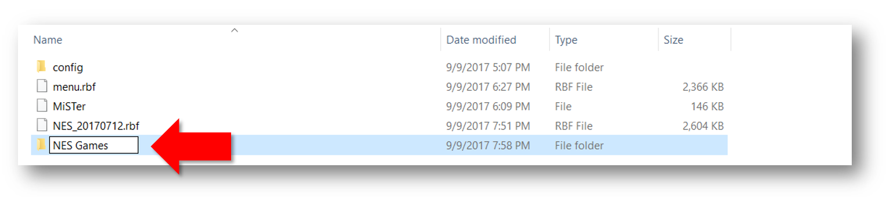

4. Download a `.nes` ROM (Game) file and copy it into your `NES Games` folder. You have to google that by yourself...

 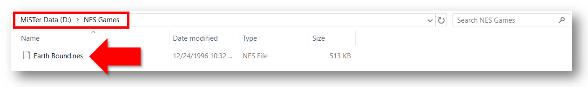

### Fire it up!

1. Make sure the SDRAM-Board is attached to the GPIO header JP1 of the DE10-Nano (See [SDRAM Wiki-Page](SDRAM-Board) for further instructions). Connect the board via HDMI to an monitor and via USB-OTG adapter to a keyboard. Do not connect the power supply yet.

 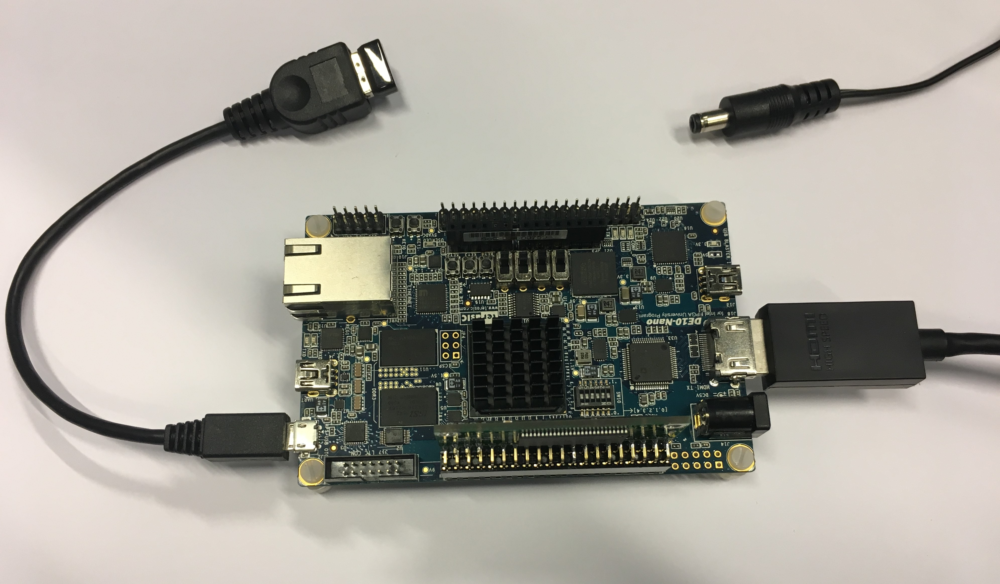

2. Remove the SD-card from you PC and insert it in the DE10-Nano board.

 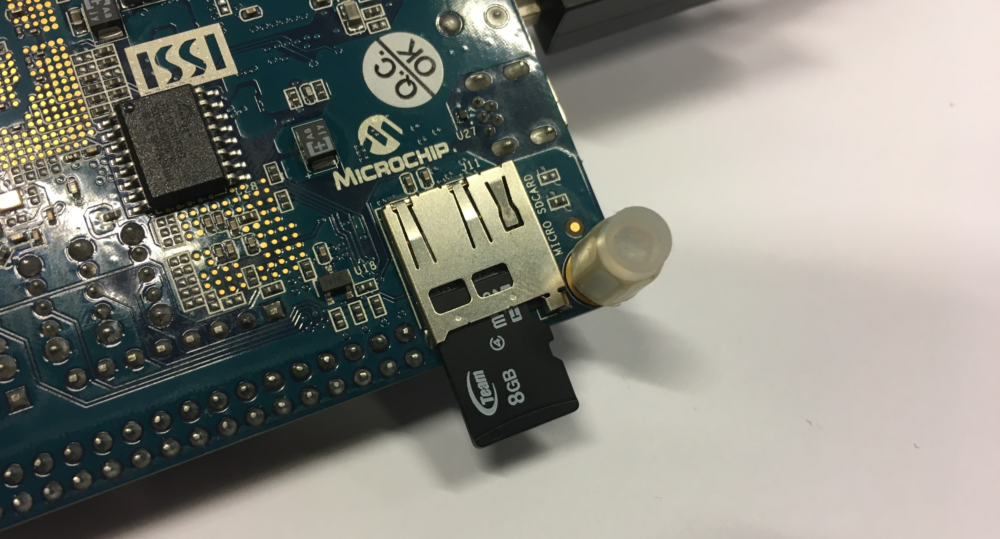

3. Connect the power supply. This will turn on the DE10-Nano board. You will see the MiSTer menu on the monitor. You see in the menu the NES core we have copied to the SD-card. Hit the **enter** key on your keyboard to start it.

 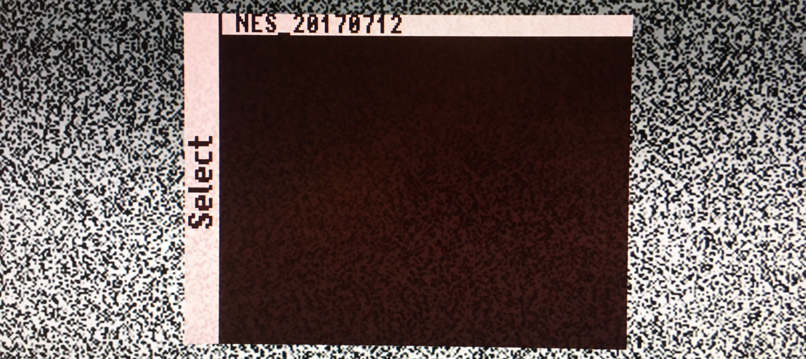

4. You will see a black screen. This is normal because no ROM is loaded yet. Press F12 on your keyboard to bring up the MiSTer menu. In order to run a game, select **"Load *.NES"** and hit **Enter**.

 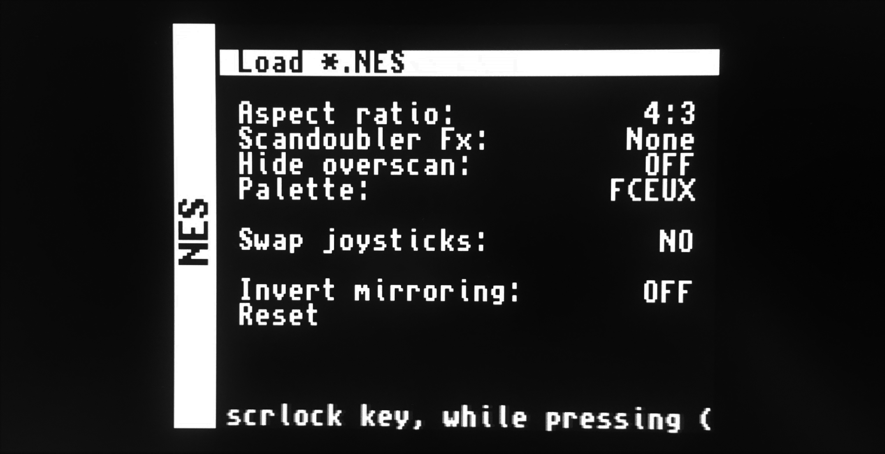

5. This will bring up the SD-card root directory. Navigate into your "NES Games" folder and select the ROM you want to start and hit **Enter**..

 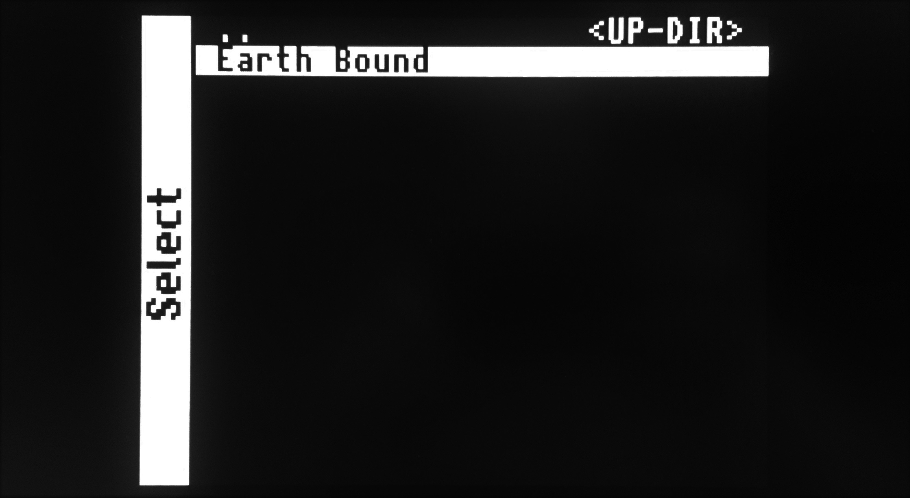

6. Congratulation, you successfully started you first game on your MiSTer!!!

 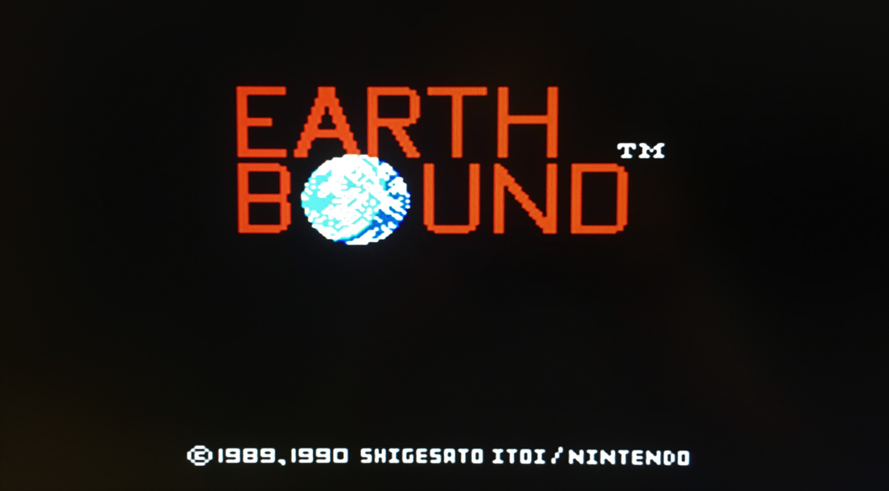

# Additional notes
Once you've installed Release_20180115 or later, you can install future updates on MiSTer without removing the SD card. It's done in 2 stages:
1) Copy everything from **files** folder of release to /media/fat using FTP client and then reboot MiSTer (use LShift+LCtrl+LAlt+RAlt combination).
2) Login serial console or ssh and type **updateboot** and then reboot again.

Usually bootloader has none or little change and not always requires update. But for better experience it's advised to update the bootloader with every release. If somehow new version of Linux won't be able to boot with previous bootloader, then simply use SD Install Tool to update the bootloader (**Update Boot** button).