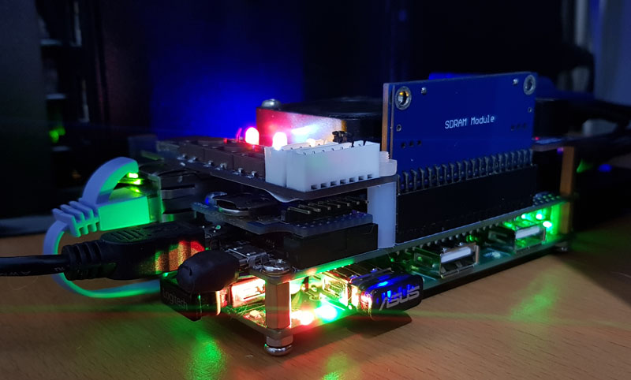
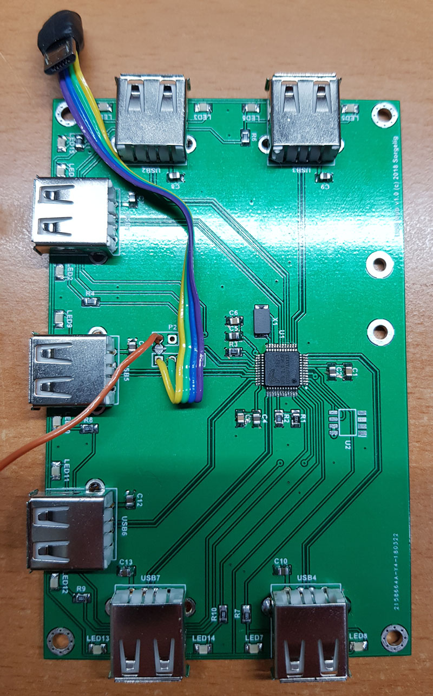
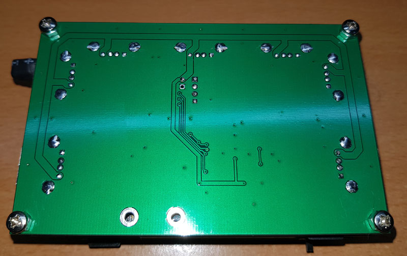
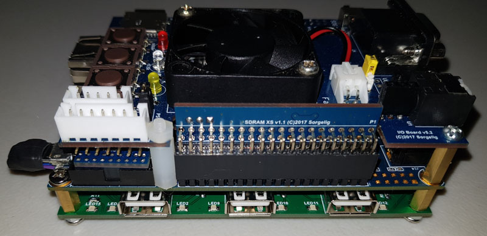
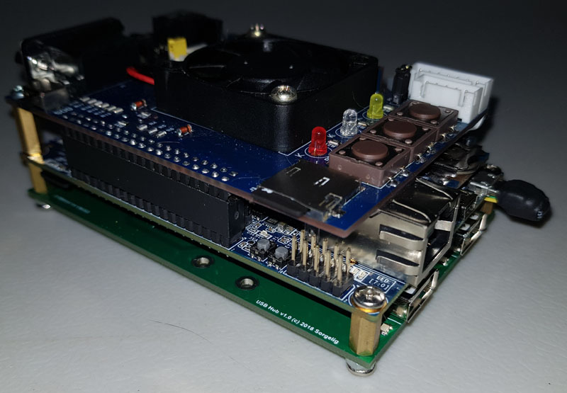
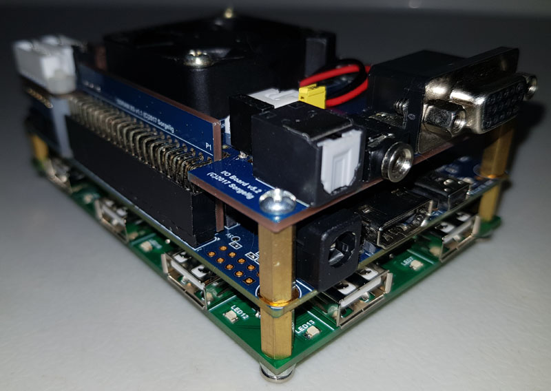
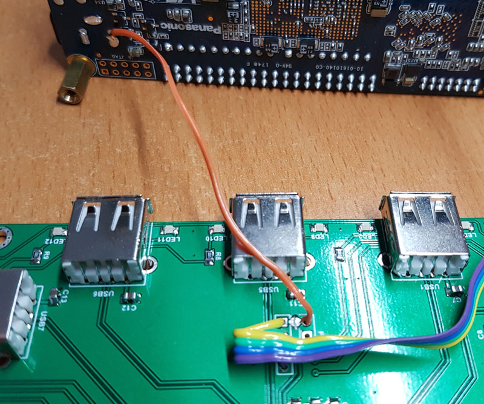
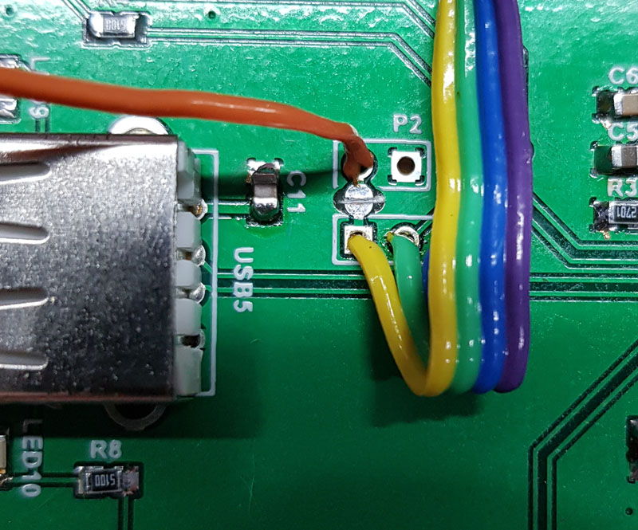

This is an optional board made for convenience USB device connections. With this board the whole construction is more solid and nothing is floating around.

[Order v1.2 PCB on PCBWay](https://www.pcbway.com/project/shareproject/USB_Hub_v1_2_for_MiSTer.html)

[Order USB Bridge board PCB on PCBWay](https://www.pcbway.com/project/shareproject/USB_Bridge_board_for_MiSTer.html)

Hub is based on FE2.1 chip requiring just few external components. It uses 3 sides for USB sockets. Since input Micro-USB connector has flexible wired connection to the board, the user can mount it in either direction to choose the side providing USB connections.

Hub allow to use the power from either Micro-USB or external power. Second option is preferred - it will prevent USB over-current triggering. In case external power is used, small cut point (shown on picture) should be cut (or leave Micro-USB +5V wire non-soldered)!

